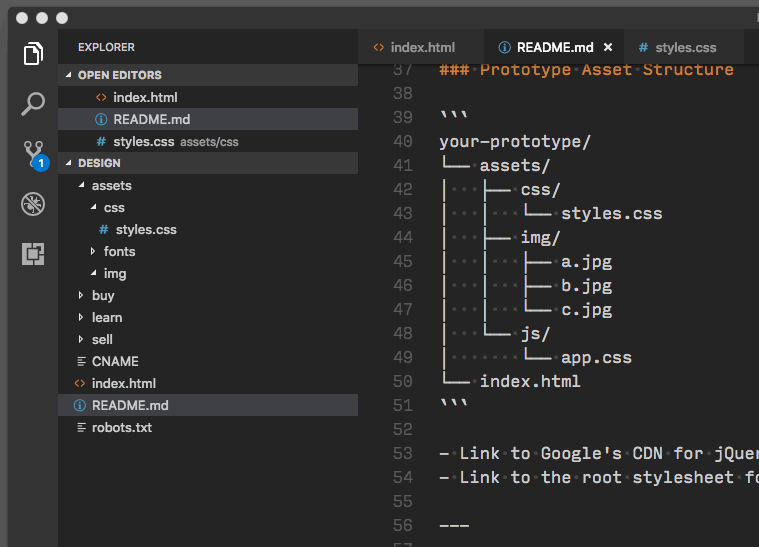

### Artsy Design - Prototypes

---

### Set up your local machine

#### Install Git
1. Open Terminal on your Mac `Applications > Utilities > Terminal`
2. Type `git` and press enter
3. Follow the instructions on screen to install OS X Dev Tools and Git

#### Create and add an SSH key to your GitHub account

1. [Create an SSH key](https://help.github.com/articles/generating-a-new-ssh-key-and-adding-it-to-the-ssh-agent/)
2. [Add SSH key to GitHub](https://help.github.com/articles/adding-a-new-ssh-key-to-your-github-account/)

#### Set your Git username and email
1. `git config --global user.name "<YOUR NAME>"`
2. `git config --global user.email "<YOUR EMAIL ADDRESS>"`

#### Download and install software
1. [VS Code](https://code.visualstudio.com/download)
2. [Sketch](https://www.sketchapp.com/)

---

### Set up your working repository

#### Clone your repository
```
cd ~
git clone git@github.com:artsy/design.git
```

---

### Prototype Asset Structure

```
your-prototype/
└── assets/
│   ├── css/
│   │   └── styles.css
│   ├── img/
│   │   ├── a.jpg
│   │   ├── b.jpg
│   │   └── c.jpg
│   └── js/
│       └── app.css
└── index.html
```

- Link to Google's CDN for jQuery rather than adding the file directly
- Link to the root stylesheet for font access tktkt 

---

### Version Control with VSCode
1. Go to Source Control tab
2. Stage all changes
3. Write a commit messge
4. Push



---

### Branching
1. Open VSCode and create a new branch
2. Commit and push branch to GitHub
3. Create a pull request to merge your branch into master
4. Delete your working branch